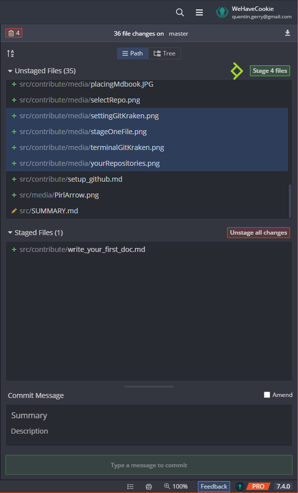
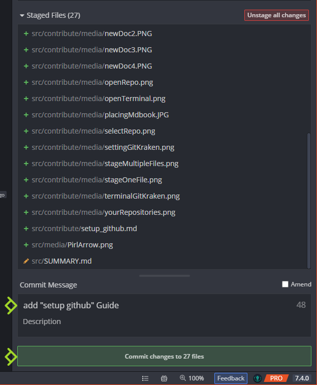
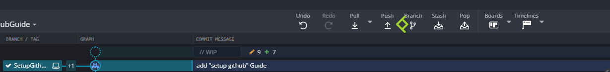
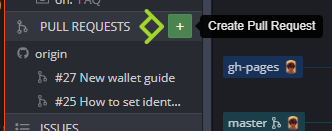
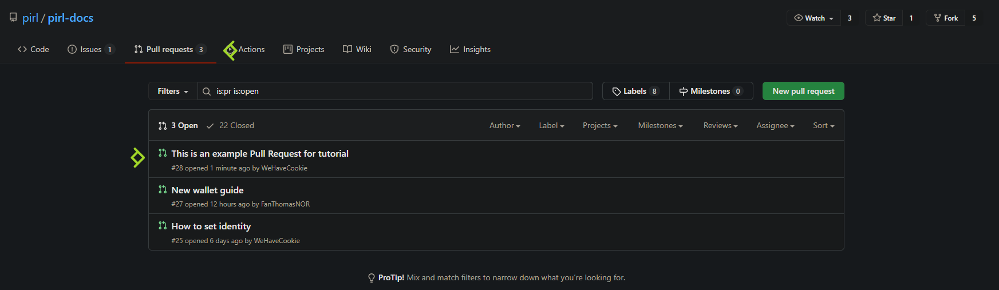

# [Windows] How to submit your contribution

Hey fellow, if you seek to contribute with pirl docs, the following guides should be usefull for people who didn't use github.

In this guide, you will see how to submit your contribution

## Setup

You will need to follow the 2 first guides : 
 - [Setup Github + GitKraken](setup_github.md)
 - [Write your first guide](write_your_first_doc.md)

 
## Make a new branch

Now you have finished to write your first guide, you will need to `push` that work on github and create a `pull request`

No worries, we do that together step by step.

Firstly, if you go back on gitkraken, you will see some changes 

On the right panel, you can see your changes. You will need to stage only the file you have created / edited.
By clicking on the file, you can see the diff view

If all seems good, you can stage your files
 - One by one
 

 - Multiple files at once (ctlr + clic)
 

When you have stage all your files, you can add a commit message then commit !

You will now see your commit on gitkraken

You can now create a new branch. Click on your commit, then on Branch and give it a cool name ! Then press enter

## Push your new branch

Then, you need to push your beautiful new branch. Simply click on Push button.

The first time you push a new branch, you will see that. Just click on submit, default parameter are good

## Create a Pull Request

Now you can create a pull request ! The final step

You can do that directly trough gitKraken. Find Pull Request section in the left panel and click on `+` button

Then setup as the following
 1. Select your repo (aka GitHubUsername/pirl-docs)
 2. Select the official (aka pirl/pirl-docs)
 3. Select the branch you just created
 4. Select master

then fill `Title` and `Description` section to give a little context.
And finally click on `Create Pull Request` button
 

You can view your pull request directly in the official repo : [https://github.com/pirl/pirl-docs/pulls](https://github.com/pirl/pirl-docs/pulls)

And voila ! You just need to wait approval from official team.

Thank you for contributing to Pirl and share the love 