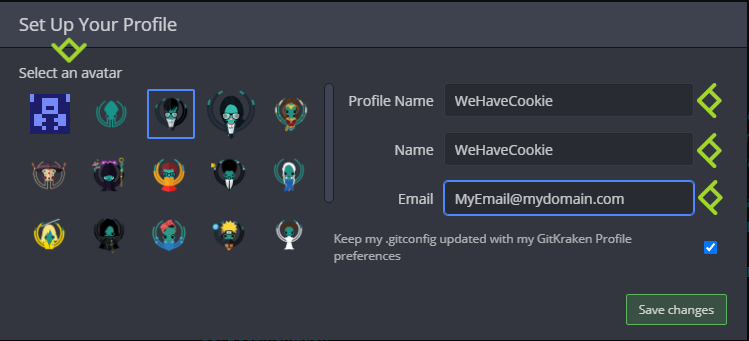
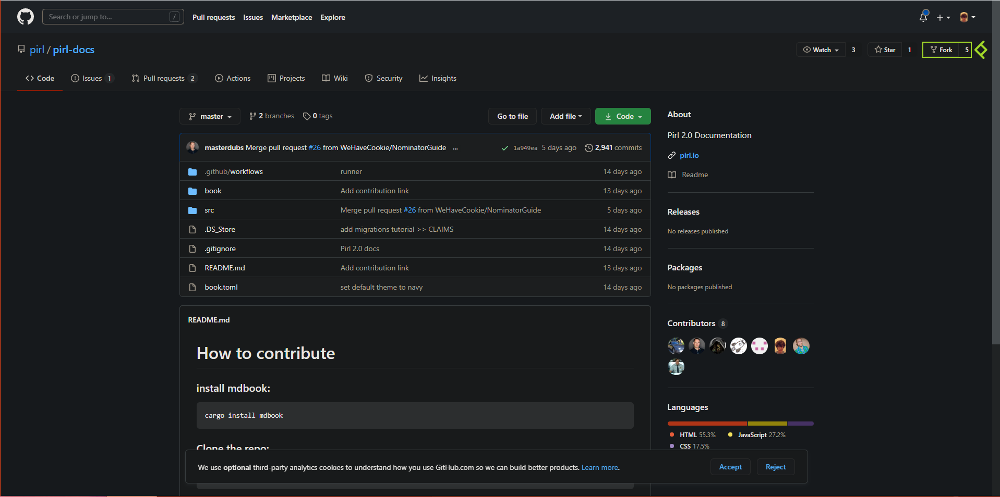
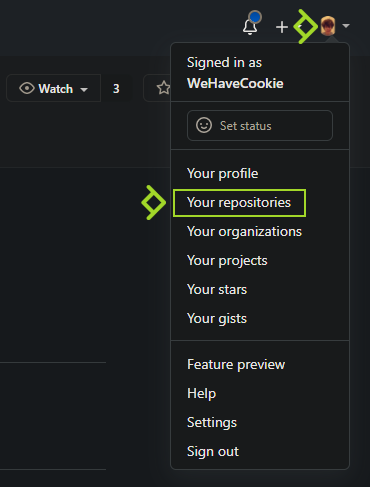
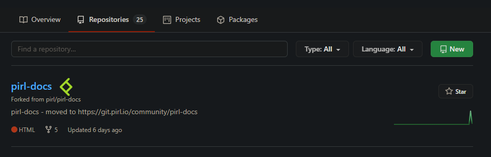
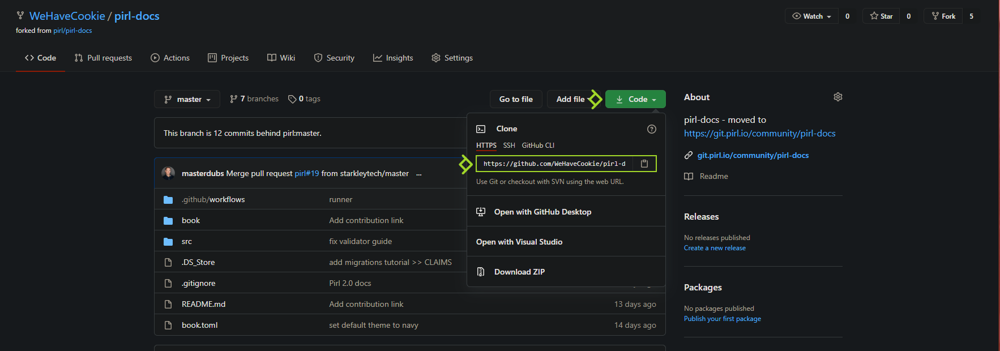
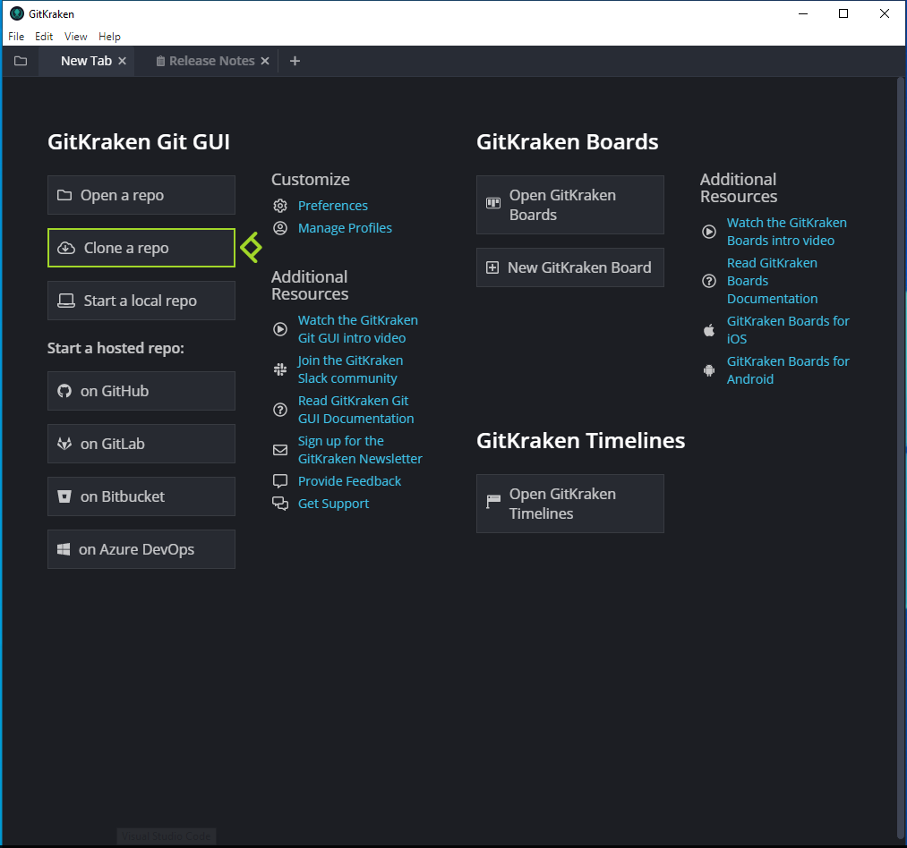
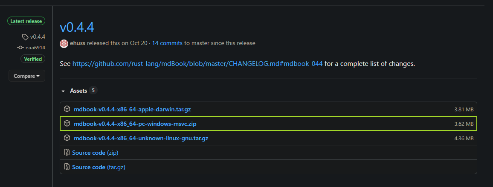
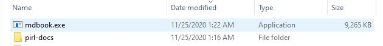
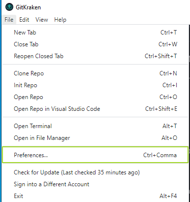
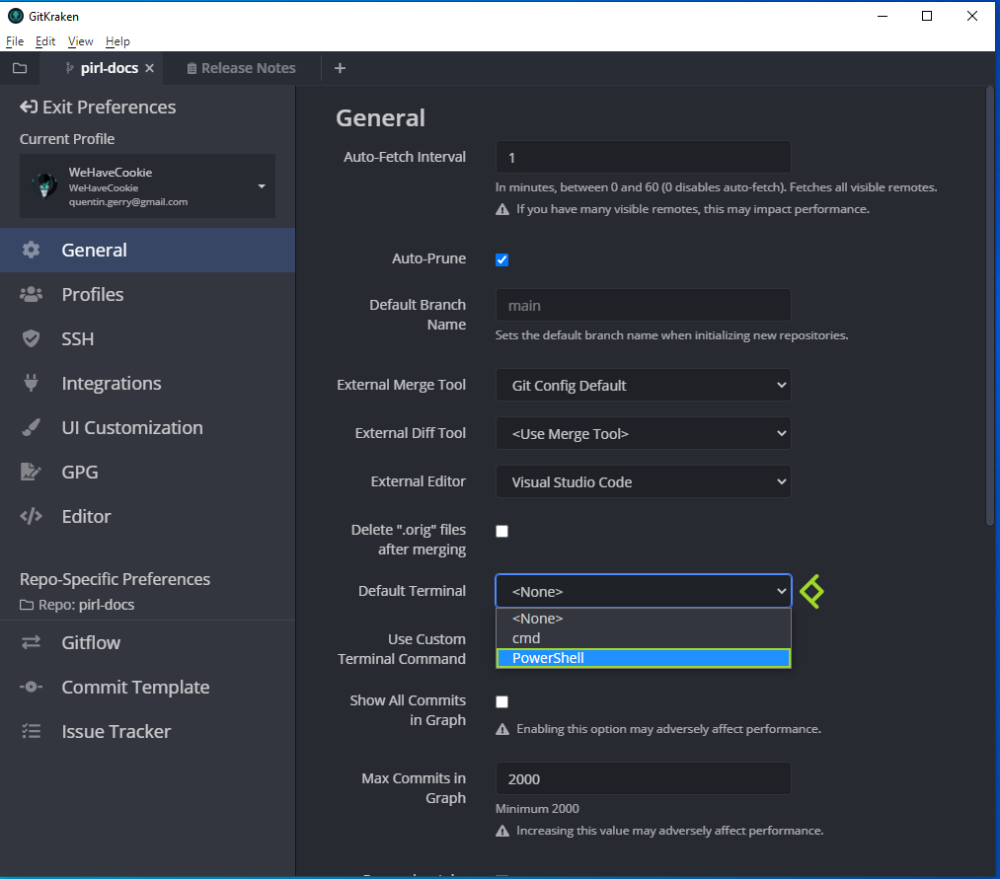

# [Windows] How to setup Github + GitKraken and start contribute

Hey fellow, if you seek to contribute with pirl docs, the following guides should be usefull for people who didn't use github.

In this guide, you will see how to create an account, fork the main repo and clone it to start to contribute

## Requirements

Firstly, go to [github](https://github.com) and create an account if you doesn't have one yet

Then I recommand you to use GitKraken (free for open source, it's our case), you can download it on [https://www.gitkraken.com/](https://www.gitkraken.com/)

When it's done, connect with your github account.

You'll need a text editor, you can use any one you want. 

For instance I use notepad++ : [https://notepad-plus-plus.org/downloads/](https://notepad-plus-plus.org/downloads/)

You have now the requirements needed to setup things !

## Setup

Go to the official depot : [https://github.com/pirl/pirl-docs](https://github.com/pirl/pirl-docs)

Then click on fork

You can retreive the fork under `Your repositories`

Then you can access it by clicking on the name

Now click on `Code` then copy the URL

Go on gitkraken then click on `clone a repo`

Choose your path then paste your previously copied URL

You can now open the cloned repo

You will need to download `mdbook` for windows at [https://github.com/rust-lang/mdBook/releases](https://github.com/rust-lang/mdBook/releases)

Extract it next to your `pirl-docs` folder

Then go on `File` -> `Preferences...`

Then select `PowerShell` under `Default Terminal`

You can exit Preferences.

You all now set to start contribute ! 
See the next [guide](write_your_first_doc.md) learn to how to write your first docs

 Written by WeHaveCookie 
