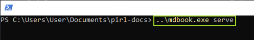
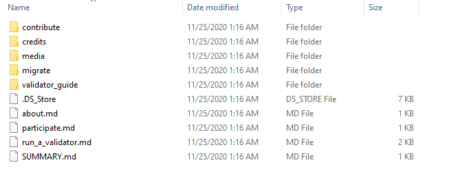
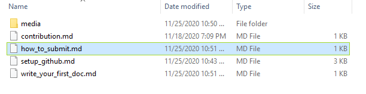
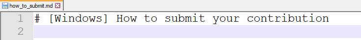
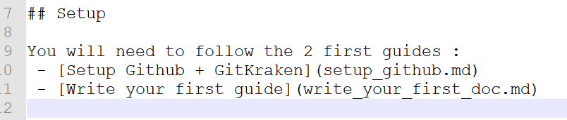
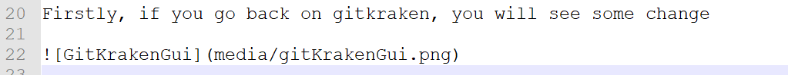

# [Windows] How to write your first doc

Hey fellow, if you seek to contribute with pirl docs, the following guides should be usefull for people who didn't use github.

In this guide, you will see how to create a new guide.

## Requirements

You will need to follow this guide first if not already done : [Setup Github  GitKraken](setup_github.md)

## Setup

Each time you want to contribute, you will need to do this following step

Under `File`, click on `Open Terminal`

Then execute the following commande `..\mdbook.exe serve`

You can reduce this window but do not close it (otherwise you will not be able to see your change in live)

## Create your first guide

Now you are all set to create your first guide ! 

You can see other guide under `pirl-docs\src` like this

> .md stand for markdown, it's a way to write document with bunch of usefull formating stuff

For example, let's create together the next guide of this serie ! (Guideception)

Create a new `.md` file (you can also duplicate an existing one)

For beginning, I'll just add the title

this snippet give this 
> # [Windows] How to submit your contribution

> #### Tips
> `#` stand for title, `##` for subtitle, `###` sub-subtitle and so one
>  

Then I add some text

this snippet give this 
> # [Windows] How to submit your contribution
>
> Hey fellow, Hey fellow, if you seek to contribute with pirl docs, the following guides should be usefull for people who didn't use github.
>
> In this guide, you will see how to submit your contribution

> #### Tips
> You will need to add an extra line between your text if you want an line break

Then I add some link to other guides

this snippet give this 
> You will need to follow the 2 first guides : 
> - [Setup Github + GitKraken](setup_github.md)
> - [Write your first guide](write_your_first_doc.md)

> #### Tips
> If you want to add a link : `[DisplayName](MyPathOrURL)`
> 
> If you want bullet, simply add ` - ` on each line 

Then I add some pictures to my guide

this snippet give this 
> Firstly, if you go back on gitkraken, you will see some changes
> 

> #### Tips
> If you want to add a picture : ``
>
> If you want to add a clickable picture (to allow user to see it in full screen) : ``
>
> The path is based on the file location, you can add `..` to access parent folder

You can find some usefull markdown keyword [here](markdown_keyword.md)

Finally, you will need to add your guide into the `SUMMARY.md` like this

And voila, it's now time to you to write your own guide and contribute to PIRL 

When you have finished writing your guide, you can move on to the next tutorial : [How to submit](how_to_submit.md)

 Written by WeHaveCookie 
