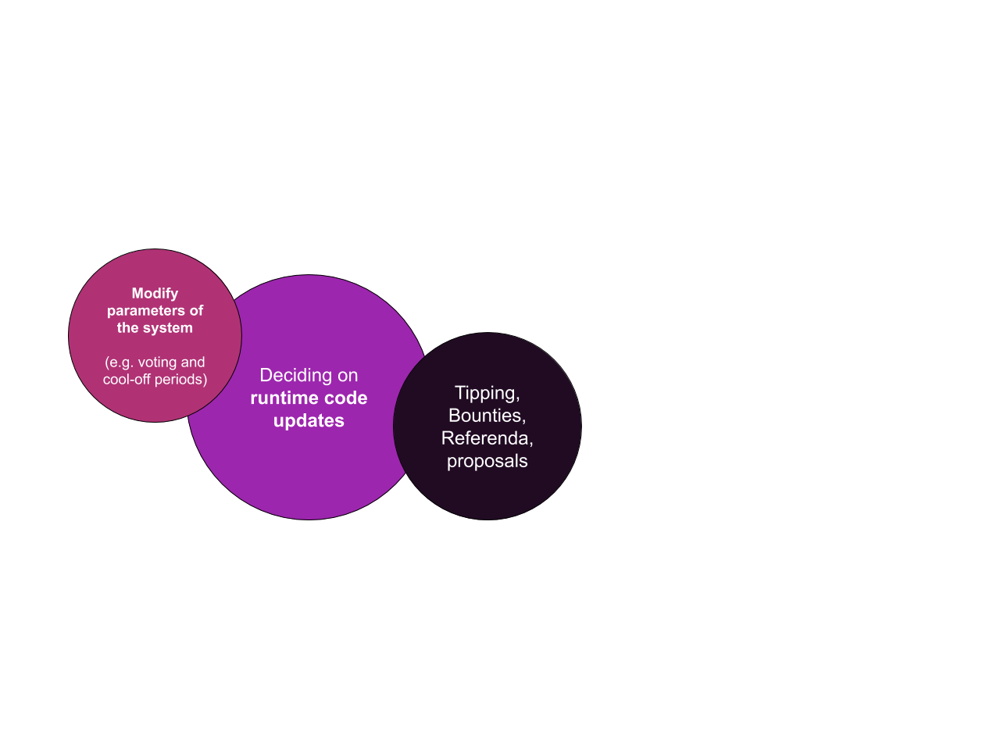
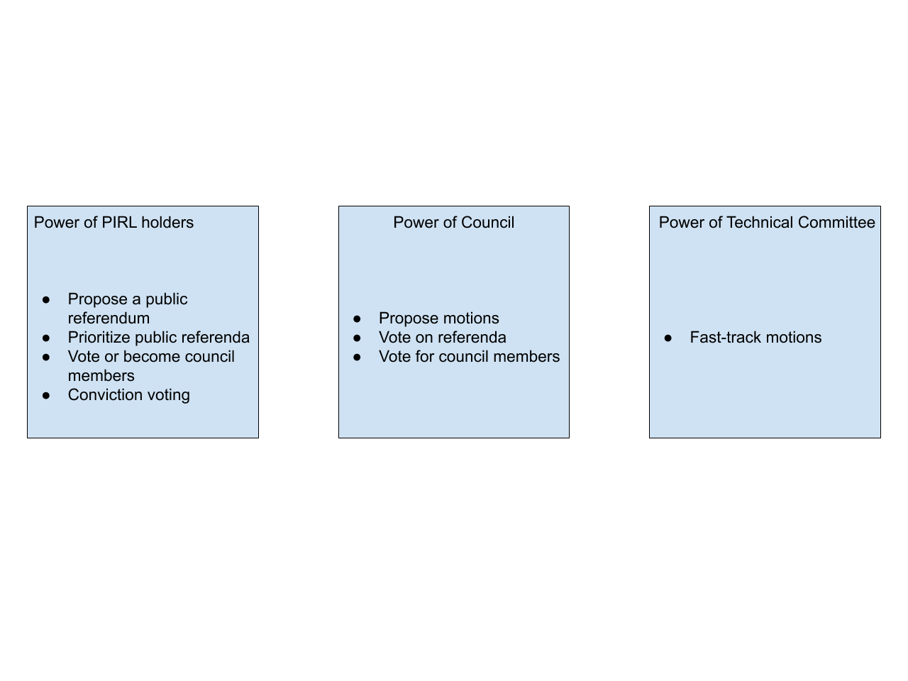

# How works democracy in PIRL 2.0 
Since PIRL moved to substrate, democracy is the new way to do things in PIRL 2.0.

But, what’s democracy in PIRL ? What does it mean ? How does it work and how can you use it to improve the network ? 

A lot of questions that we will try to answer on this paper.

Let’s jump in into democracy in PIRL 2.0 together and find out what it is

## Governance stuff & capabilities

Democracy allows anyone in the community to give their opinions and propose improvement to the network chain. It’s a really powerful tool right in the hand of PIRL 2.0 users. We can either modify the parameter of the system, deciding on runtime code updates, do typing, make bounties, propose referenda or even submit proposals. A lot of things that we will deep further later on.

## Governance structure
	
Pirl democracy is based on a tricameral governance model. 

### Technical Committee 
#### ***What can they do ?***
Technical committee is able to pass some urgent motions to ensure network stability and security. 

#### ***Why is it important ?***
They ensure the security and the stability of the blockchain. On their watch, the blockchain is reliable.

#### ***Who can be in this committee ?*** 
Is reserved to people that contribute directly to the network source and have a deep understanding on how the blockchain works technically.

### Council 
#### ***What can they do ?***
Council can vote on motions and treasury proposals/tips.  They also can submit proposals.

#### ***Why is it important ?***
Council needs to ensure that proposals made by everyone are beneficial for the network and improve it. With their power to vote, they have the ability to drive the blockchain further. They also ensure that treasury funds is well used to make the blockchain even better and can decide to tips contributor for theirs work

#### ***What are the responsibilities of a council member?***
Being on the council also means showing willingness to regularly check whether there are new motions or proposals. And maybe even if you are not sure what these are for, consult with the other members if they are known. It is also about discussing a decision together with the team.

#### ***Who can be in the Council ?***
Council members are elected each term (currently 7 days). Everyone can submit his own candidacy to be elected by the community and participate deeper into the blockchain.

### Public token holders 
#### ***What can they do ?***
They can submit proposals, votes for referenda and elect council members.

#### ***Why is it important ?***
They have the ability to elect council members, through them, they could improve the blockchain. Every vote count and every proposal count. The referenda allows Public token holders to votes on important motion

#### ***Who can be Public token holder ?***
Anyone with pirls is part of the community. You’re already part of the community ! 

Thanks you for your participation into PIRL 2.0 democracy 

 Written by WeHaveCookie 
