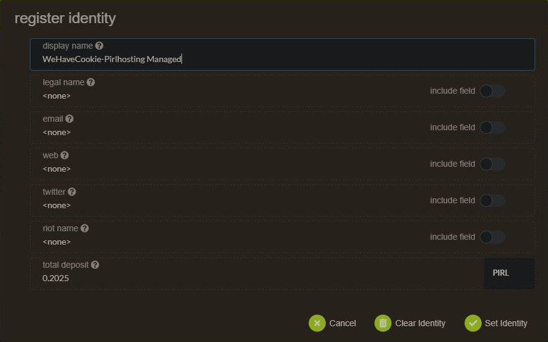

# How to setup identity

Go to [account panel](https://explorer.pirl.network/#/accounts)

> If you want to name your validator, be sure to select the stake account and not the controller account

Click on 3 dot for the right account, then on `Set on-chain identity`

Then fill your info and click on `Set identity`

That's it ! 

 Written by WeHaveCookie 
