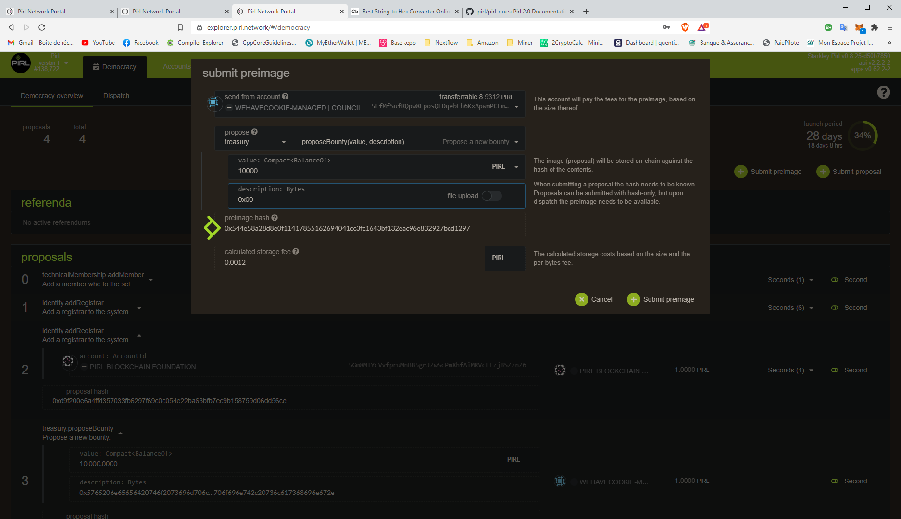
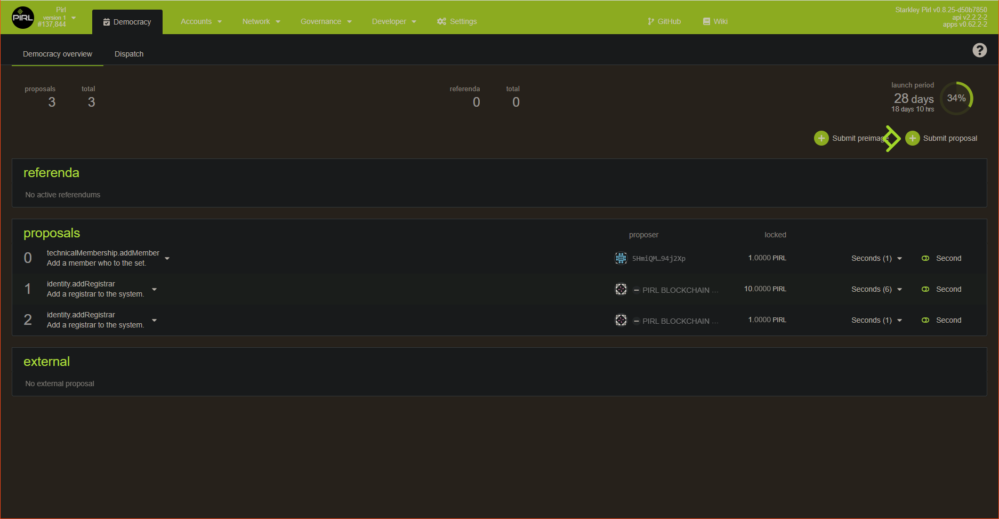
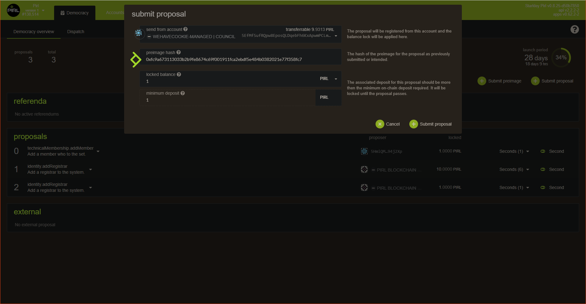
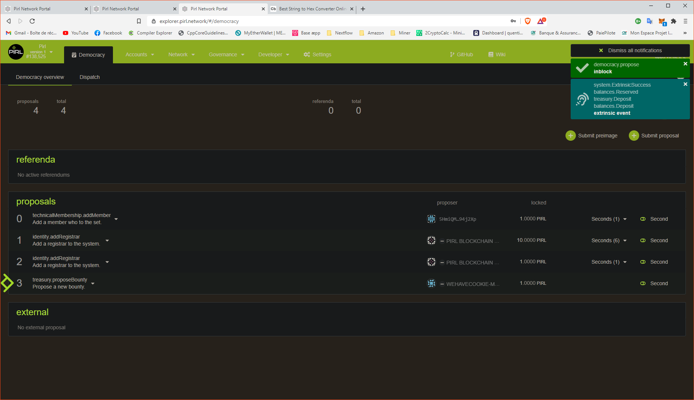

# How to submit a proposal

Hey fellows ! In this guide, you will see how to create and submit a proposal to the council.

Proposal allow any users to share idea to improve the network and submit this idea to the council.
Proposal need to be seconds by other users to be submitted to the vote of the council.

Go on [democracy panel](https://explorer.pirl.network/#/democracy) then start by `Submit preimage`

Then choose the right category for your proposal, in this case we want to propose a new bounty so we choose `treasury` then `proposeBounty`

We specify the value (in this case the reward of the bounty) and description for this proposal. Then **before** submit, **copy-past** the `preimage hash`. **Do not forget to do this** otherwise you will need to retrieve the hash into the explorer.
> Currently the network doesn't allow user to put text field. So you will need to detail your proposal into the discord channel `proposal-voting`
> This feature is under the hood.

When this is done, click on `submit proposal`

Copy the `preimage hash` from the previous step

You should see your new proposal now

You can now give us more context on discord ! 

And thanks you for your contribution 
