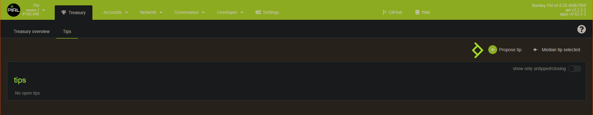
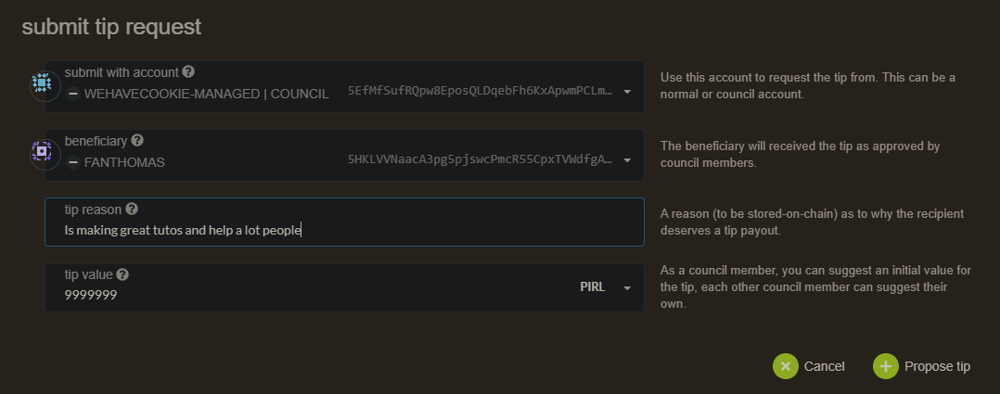

# How to make a treasury tips 

Hey fellows ! In this guide, you will see how to submit a treasury tips.

If you wonder how you can propose a tip for people that you think deserves some kind of gratitude, you could propose a tip !

> Tips can be suggested by anyone and are supported by members of the Council.

Go on the tips page from Treasury tabs : [https://explorer.pirl.network/#/treasury/tips](https://explorer.pirl.network/#/treasury/tips)

Then click on `Propose tip`

You will need to choose a beneficiary, fill the tip reason (why council shoud accept this tips request) then a tips value.

> The final value of the tip is decided based on the median of all tips issued by the tippers (council members).

> Tip will enter a closing phase when more than a half plus one of the council have endorsed a tip.
> So it should be done with justified reason.

When the 7th council member voted, a 24 hours countdown does start, then when this is over, a council member
need to close the tip.

Then the tips is proceed

Thanks you for contributing in PIRL 2.0 

 Written by WeHaveCookie 

