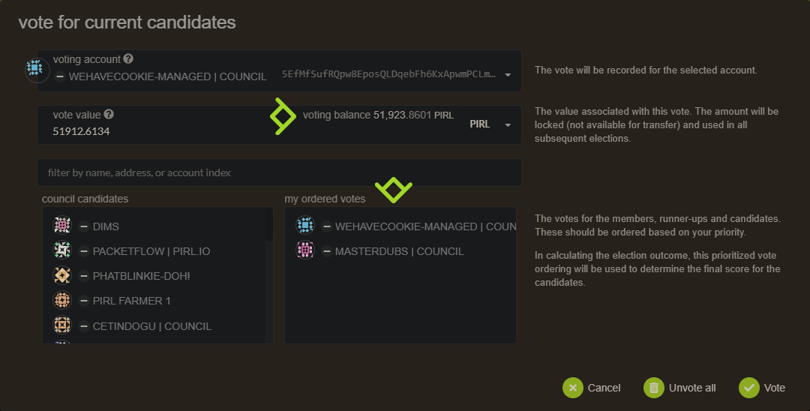

# How to vote for candidates to council

Hey fellows ! In this guide, you will see how to cast your vote for nominate council member

It's pretty straigthforward but I think it's important to do a note on this, cause it's an important process in PIRL 2.0

All proposals and treasury tips are submitted to the vote of the council. They have the power to improve the network. So i'ts important to cast your vote and choose wisely.

Go on [council page](https://explorer.pirl.network/#/council)

You can see some info like current council members and candidates for next election.
Council members are elected for 7 days.

On the top right, you can either `vote` for next election or `submit a candidacy` to be maybe into the next council.

Click on `vote` to cast your vote.

You can see your vote value (equal to the pirl amount of your account used to vote)

You can votes for more than 1 user. Just be carefull because vote is prioritized.

> **Do not forget**
> The amount used for vote will be locked (not available for transfer)

Thanks you for your participation into PIRL 2.0 democracy 

 Written by WeHaveCookie 
