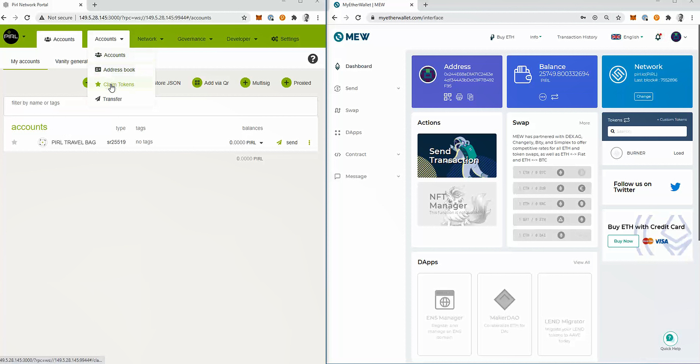
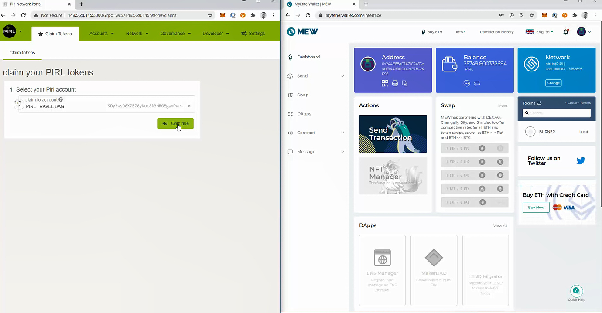
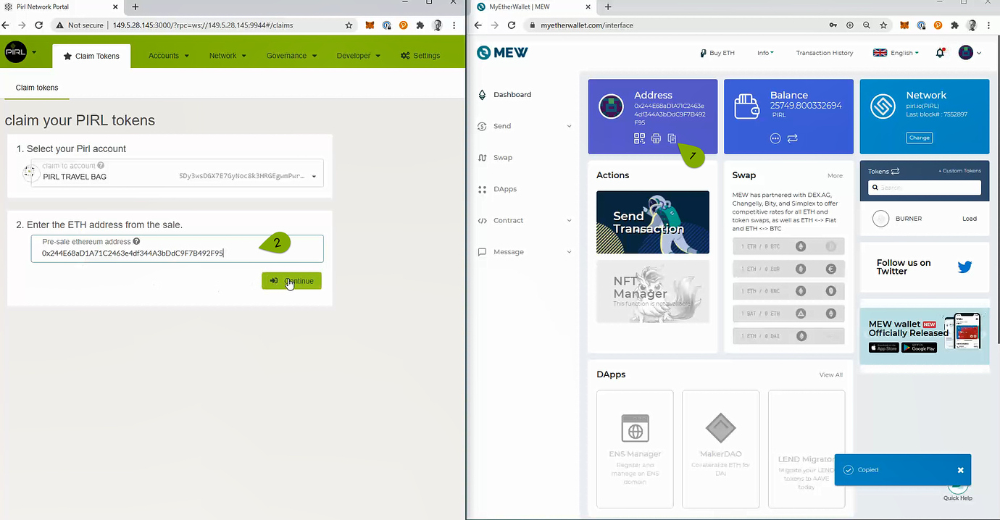
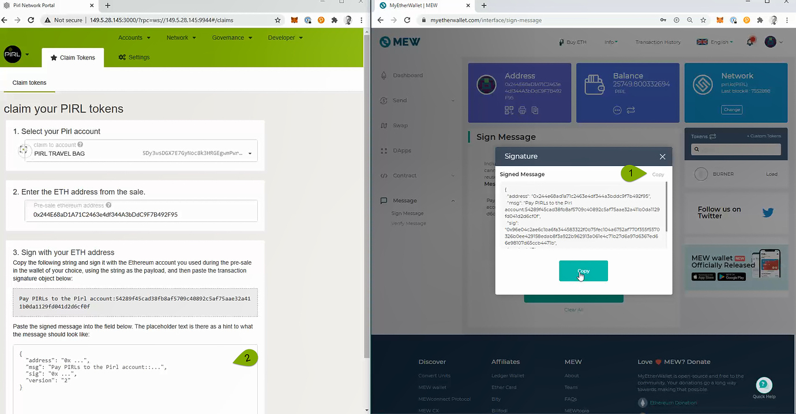
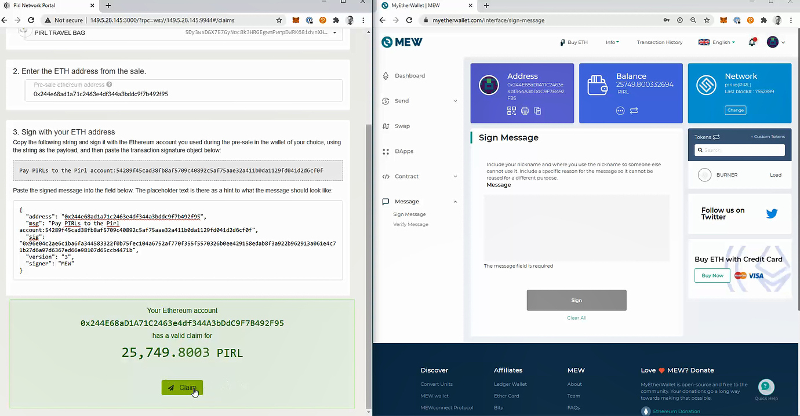

# Claim PIRL coins from old chain to Pirl 2.0

This tutorial describes how to claim your Pirl from “old chain” to Pirl 2.0. 
Balance of Pirls where taken from snapshot at block 7 650 000, meaning you will only be able to claim what you had in balance at this block.

In this tutorial we will use the MEW wallet and Pirl 2.0 Portal. 
Before proceeding, you will have to create a wallet in the Pirl 2.0 Portal and log in to your Pirl wallet in [MEW](https://www.myetherwallet.com/access-my-wallet) using your Keystore file.

If you dont get any Pirl balance in the MEW wallet, please check your Network settings (1) and set to (PIRL) as shown in picture below. 
- <strong>Note:</strong> It has been tested and verified that the claim works fine without changing the network as well.

## [Pirl 2.0 Portal https://dashboard.pirl.network](https://dashboard.pirl.network) 

In Pirl Portal, click Account and choose “Claim Tokens”.

Choose your Pirl 2.0 wallet that you want to use for your claim, and click “Continue”

Copy your Pirl adress from MEW (1) and paste in to Pirl 2.0 Portal (2), and click “Continue”

Go to “Message” in MEW (1)
Copy string from Pirl 2.0 Portal (2) and paste in to MEW (3), and click “Sign” and “Confirm Signing” in the next box.

Copy signature message from MEW (1) and paste in to Pirl 2.0 Portal (2), and click “Confirm claim”.

If everything goes well, you will get a confirmation message as shown below.
Click “Claim” and then “Submit” in the next box to collect your Pirls.

After a few seconds your Pirl 2.0 balance will be updated with the claimed Pirl.

Well done !

If you have any feedback or comments to this tutorial, [please make a reply in this forum](https://community.pirl.io/t/claim-pirls-from-old-chain-to-pirl-2-0-tutorial/131).

## Thank you @Fantomas for the tutorial

