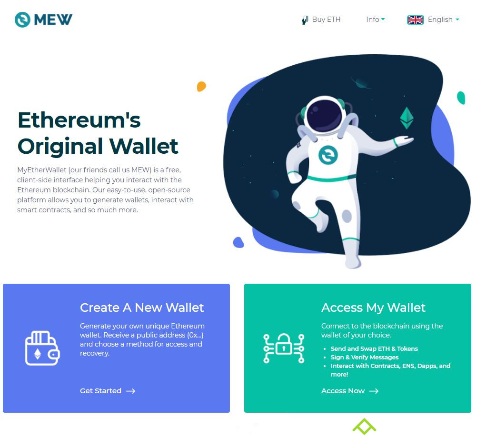
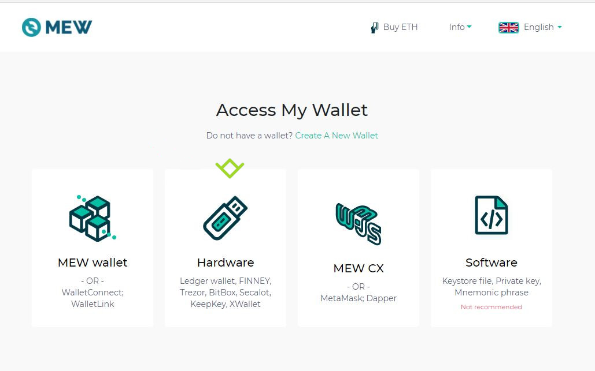
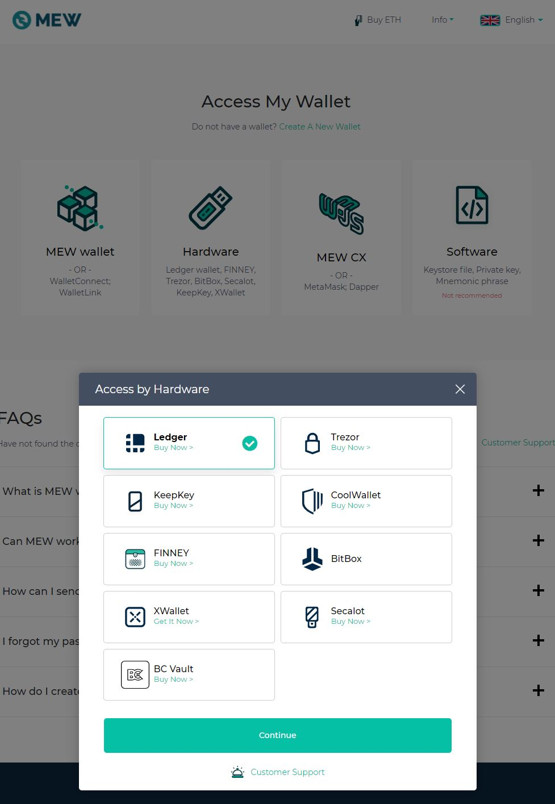
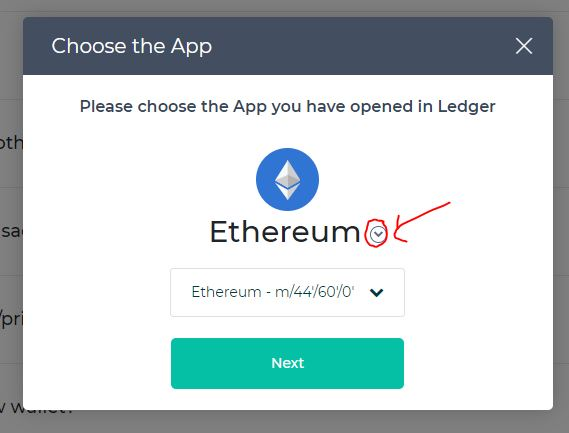

# How to connect your ledger wallet through MEW for claiming your asset

Firstly, go to [MEW](https://www.myetherwallet.com/) then click on Access My Wallet

Then select Hardware

Then select the kind of hardware wallet you use (in our case Ledger, but should be revelant for other)

> Do not forget to open the pirl app in your Ledger

Then click on the arrow next to Ethereum to see all network available

Then select the Pirl network

Then choose your address, check ti accept Terms and tada !

Now you can proceed to [claim guide](./claims_coins.md)
