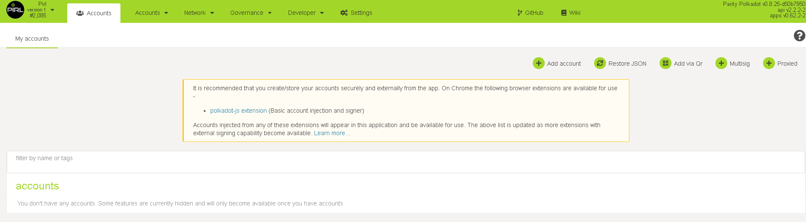
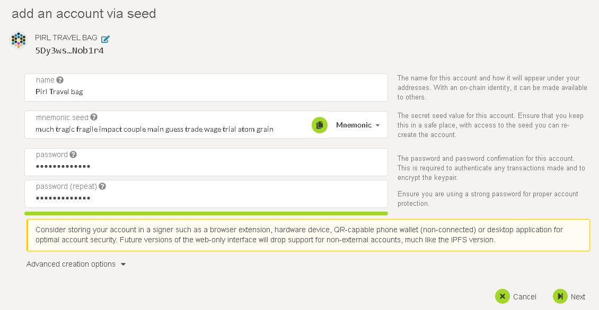
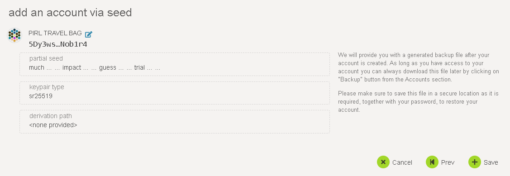
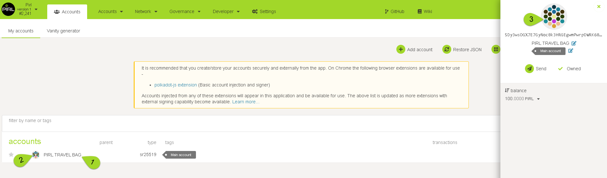

# This tutorial covers how to make a new Pirl 2.0 wallet adress.

## Pirl 2.0 - Portal:
Go to [Pirl 2.0 Portal - https://explorer.pirl.network](https://explorer.pirl.network) 

The new Pirl portal contains wallets,explorer,stats,voting,staking ++

### To open a new Pirl Account/wallet on the new chain, click “Add account”

  
1. Insert a wallet name.
<strong> Important! Create backup of Mnemonic and store in a safe place. </strong>
2. Make a password for your new account
3. Click <strong> “Next” </strong>

### Summary page.

1. Click <strong>“Save”</strong> to generate the new wallet and new Keystore file. 
<strong>Important! Remember to backup your wallet info, and keep it somewhere safe.
 YOU are the only responsible for your own wallets.</strong>

### General info.
To find general info, click on the wallet name (1)
To copy wallet adress click on symbol (2) or (3)

