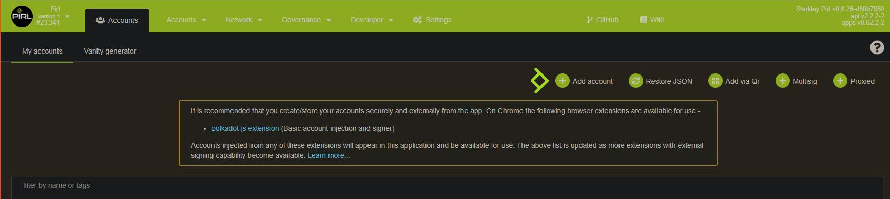
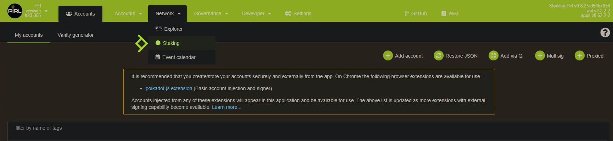
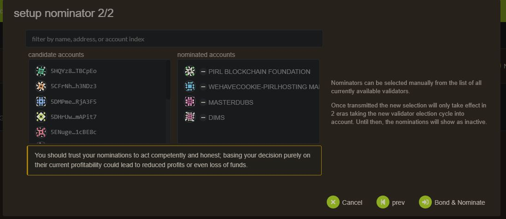
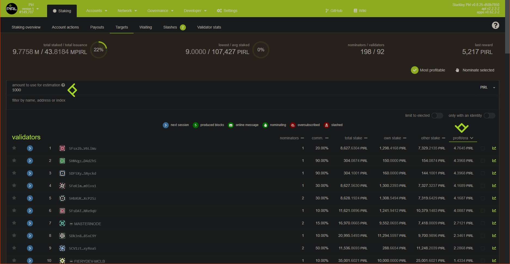
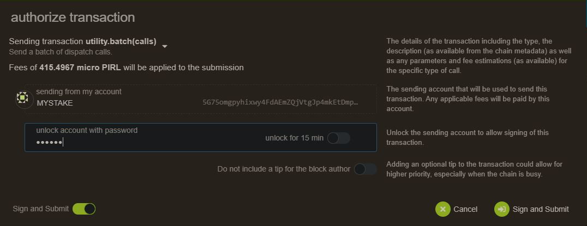

# How to be a Nominator

## Requirements
>
>You need an account with some pirl on it. If you have a Pirl 1.0 account and do not have claim it yet on the new blockchain, please refer to this [tutorial](https://docs.pirl.io/migrate/claims_coins.html) 
>

## Setup
1) You need to create a new account for control your staked

2) Then send some pirl for covering network fees

3) Then go to staking panel

4) Add nominator

5) For stash account, select the account with you stash (the one with all your precious pirl) and for controller account, the newly created account in step 1

6) Choose your validator, you can choose multiple validators. This choice is up to you. 

> ## WARNING
> For avoiding being <strong>slashed</strong> (aka <strong>loose money</strong>), choose wisely your validator !
> The validator need to have good uptime (99.99%) and good behaviour (see [How does slashing works ?](https://docs.pirl.io/migrate/in_brief.html#how-does-slashing-works-) for more info about slashing).
> The list below is purely indicative and not a recommandation.
>  

> ## Info
> Rewarding system work as follow :
>
> Validator are reward by block reward + 20% transaction fee. <strong>This do not depend on stake amount ! </strong>
>
> Validator take a % commision (you can see that info in [staking overview](https://explorer.pirl.network/#/staking))
>
> Validator and Nominator share the remaining reward according to their share
>
>> Eg. Validator has 100 pirl staked, NominatorA has  50 pirl staked and NominatorB has 200 pirl staked
>>
>> Validator get 28.57% of the remaining reward, NominatorA 14.29% and NominatorB 57.14%.
>
> You can check potential profit/era in the [targets panel](https://explorer.pirl.network/#/staking/targets),
> but be carreful, this value change according to nomination on each era
>
>  

7) Now you need to authorize transaction

8) And tadaa ! Enjoy stacking with Pirl. Your all done.
