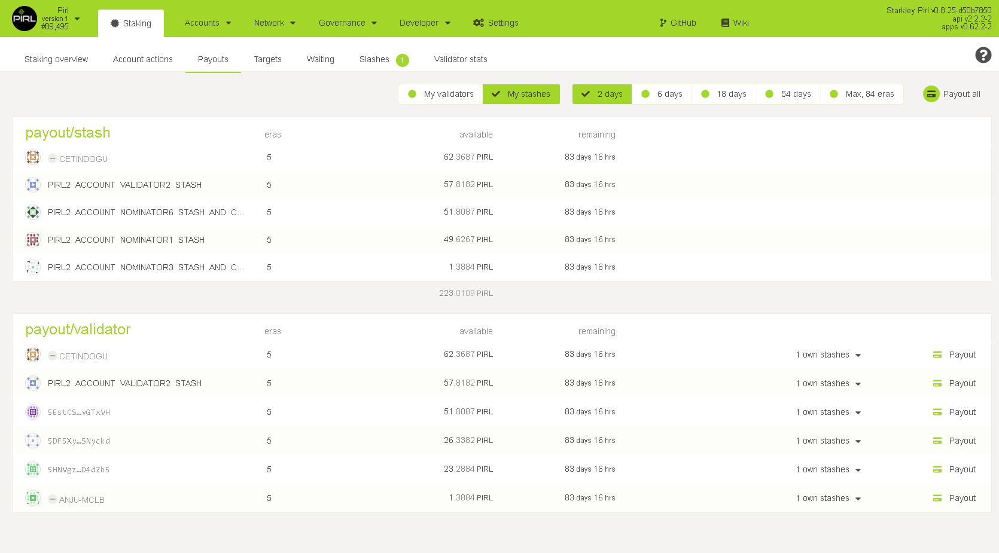

# How to Payout

>To claim rewards on Dashboard UI, you will need to be in the "Payouts" tab underneath "Staking", which will list all the pending payouts for your stashes.

pending-payouts

>To then claim your reward, select the "Payout all" button. This will prompt you to select your stash accounts for payout.

>Once you are done with payout, another screen will appear asking for you to sign and submit the transaction, and that is all there is to claiming rewards.
