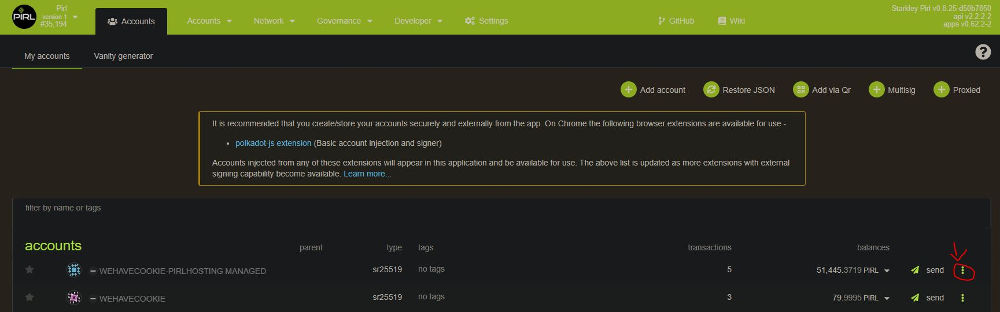
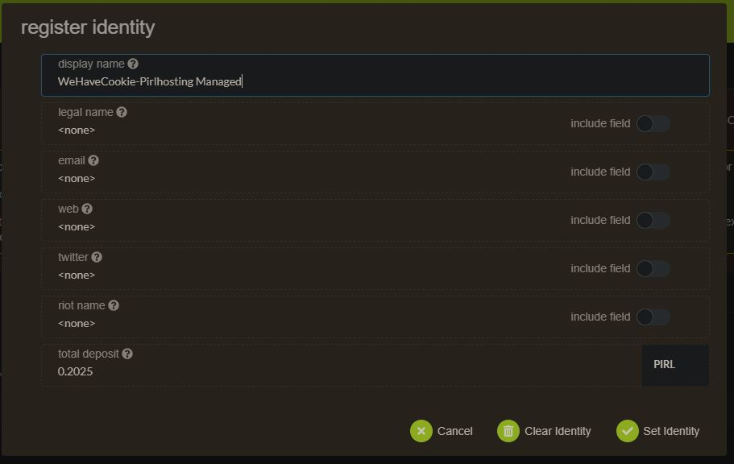

# How to setup identity

Go to [account panel](https://explorer.pirl.network/#/accounts)

Then click on 3 dot for the account you and to identifie

> If you want to name your validator, be sure to select the stake account and not the controller account

Then click on Set on-chain identity

Then fill your info and click on Set identity

That's it ! 