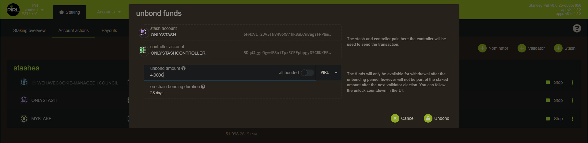

# How to unbound fund

Hey fellows, you will see in this guide how to unbound fund from staking, and how to rebound fund previously unbound.

Firstly, go on the [Staking tab](https://explorer.pirl.network/#/staking/actions) under Network tab
You can see here your current stashes.

## Unbound
If you want to unbound some pirl, just click on the 3 `dots` on the right of you choosen stashe then select `Unbound funds`

Then enter the amount you want to unbound and `submit transaction`

Now, you will need to wait around 28 days to can use your unbounded pirl. You can see the remaining blocks when you hover 

## Rebond
In case you have unbound by mistake (10k instead of 1k for instance) you can rebound your fund without have to wait the unbound period of 28 days.

To rebound you fund go on [extrinsics tab](https://explorer.pirl.network/#/extrinsics) under Developer tab.

1. Choose your **Controller** account
2. Select **staking**
3. Select **rebond(value)**
4. Specify the number of pirl you want to rebond

Then submit your transaction
You should now see your pirl rebond and available for staking ! 

Thanks you to use PIRL 2.0 

 Written by WeHaveCookie 

