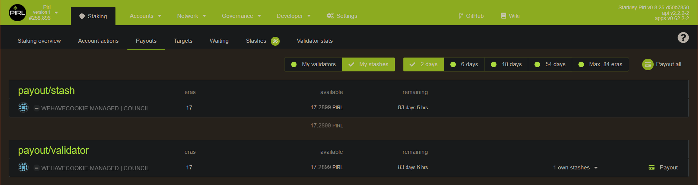
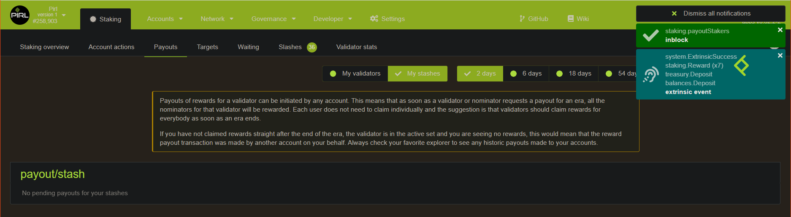

# How payout works

You can find your pending payout in the [payout tab](https://explorer.pirl.network/#/staking/payout)

## Validator

## Nominator

When you click on `Payout button`, you request the payout of your reward. This request is made for everyone associated on this validator.

Like you can see on this picture, when I request an payout, this is effective for all my nominators (and my nominators can also request the payout).

> When a payout is done, both validator and nominators get their respective rewards and the payout disappear from this tab for everyone, because it has already processed
>
> So it's normal to not always seen an payout on the payout tab, that's mean somebody already request the payout and it's already processed.

 Written by WeHaveCookie 

