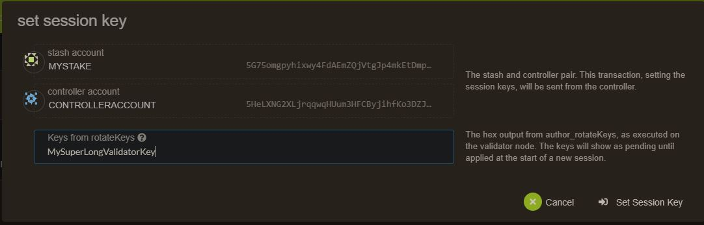

>## WARNING 
> If you don't use the right requierements you could have your stake 
> slashed, this guide is a baseline, if you do it your own way be 
> sure to know what you are doing or <strong> you will loose money</strong>.
> <br></br>

## Requirements

The most common way for a beginner to run a validator is on a cloud server running Linux. You may choose whatever [VPS providers](#list-of-vps-providers) that your prefer, and whatever operating system you are comfortable with.

The transactions weights in Pirl were benchmarked on standard hardware. It is recommended that validators run at least the standard hardware in order to ensure they are able to process all blocks in time. The following are not minimum requirements but if you decide to run with less than this beware that you might have performance issue.

### Minimum Hardware :

- 10GB ram, 60 GB Storage, 4 CPU , <strong>stable server uplink connection with fixed IP</strong>

### Ideal Hardware :

- 60GB ram, 300 GB Storage, 6 CPU, <strong>stable server uplink connection with fixed IP</strong>

### Using Ubuntu 18.04 : 

Install Rust
Once you choose your cloud service provider and set-up your new server, the first thing you will do is install Rust.

If you have never installed Rust, you should do this first. This command will fetch the latest version of Rust and install it.
```
curl https://sh.rustup.rs -sSf | sh
```

Otherwise, if you have already installed Rust, run the following command to make sure you are using the latest version.
```
rustup update
```

Finally, run this command to install the necessary dependencies for compiling and running the Polkadot node software.
```
sudo apt install make clang pkg-config libssl-dev build-essential
```

Note - if you are using OSX and you have Homebrew installed, you can issue the following equivalent command INSTEAD of the previous one:
```
brew install cmake pkg-config openssl git llvm
```

Install & Configure Network Time Protocol (NTP) Client
NTP is a networking protocol designed to synchronize the clocks of computers over a network. NTP allows you to synchronize the clocks of all the systems within the network. Currently it is required that validators' local clocks stay reasonably in sync, so you should be running NTP or a similar service. You can check whether you have the NTP client by running:

If you are using Ubuntu 18.04 / 19.04, NTP Client should be installed by default.
```
timedatectl
```
If NTP is installed and running, you should see System clock synchronized: yes (or a similar message). If you do not see it, you can install it by executing:
```
sudo apt-get install ntp
```
ntpd will be started automatically after install. You can query ntpd for status information to verify that everything is working:
```
sudo ntpq -p
```

>WARNING: Skipping this can result in the validator node missing block authorship opportunities. If the clock is out of sync (even by a small amount), the blocks the validator produces may not get accepted by the network. This will result in ImOnline heartbeats making it on chain, but zero allocated blocks making it on chain. 
>


## Building and Installing the pirl Binary


<br>

# Centos 8

Install and configure time
```
dnf install chrony
```

Enable it
```
systemctl enable chronyd
```

Allow the process in firewall

```
firewall-cmd --permanent --add-service=ntp && firewall-cmd --add-port=30333/tcp --permanent && firewall-cmd --reload
```


If you have never installed Rust, you should do this first. This command will fetch the latest version of Rust and install it.
```
# curl https://sh.rustup.rs -sSf | sh
# source $HOME/.cargo/env
```


Otherwise, if you have already installed Rust, run the following command to make sure you are using the latest version.
```
rustup update
```

Install development tools

```
dnf group install "Development Tools" -y
```

Install other tools needed

```
dnf install -y cmake llvm  llvm-devel clang
```

Install rust tools

```
rustup toolchain install nightly-2020-10-06
rustup update nightly
rustup update stable
rustup target add wasm32-unknown-unknown --toolchain nightly-2020-10-06-x86_64-unknown-linux-gnu
```

clone Pirl from github

```
git clone https://github.com/pirl/pirl-2_0
```

move to pirl-2_0 directory and build it

```
cargo +nightly-2020-10-06-x86_64-unknown-linux-gnu build --release
```

Copy the binary ready to use

```
 cp -rp target/release/pirl /usr/bin/
```


## Make the service permanent

create systemd file in /usr/lib/systemd/system/pirl.service

```
[Unit]
Description=Pirl Validator
After=network-online.target

[Service]

ExecStart=/usr/bin/pirl  --port "30333"   --ws-port "9944"   --rpc-port "9933" --validator  --name "CHANGE IT TO A DESIRED NAME"
User=root
Restart=always
ExecStartPre=/bin/sleep 5
RestartSec=30s

[Install]
WantedBy=multi-user.target

```

Check if your node is appearing in the telemetry UI : [https://telemetry.polkadot.io/#list/Pirl](https://telemetry.polkadot.io/#list/Pirl)


## Step 2 Assign the node to an account

We assume that you have already claim your coin from Pirl 1.0 (see [how to claim](https://docs.pirl.io/migrate/claims_coins.html)) or you already have an account with your Pirl on it.

You need to create an controller account in order to do the next steps. 

>The stash account serve as you "cold wallet" with all your precious coin
>
>The controller account serve as a manager to your stash account
><br></br><strong>Always keep in safe place your keystore file or your 12/24 words seed</strong>

To create an controller account, add account


Choose any name that suit for you


Then send some pirl (from your stash account) for covering network fees


You can proceed to the next steps

### Create session key:

Go in you terminal where the node is installed and paste the current command, you will have a session key of your node.

```
curl -H "Content-Type: application/json" -d '{"id":1, "jsonrpc":"2.0", "method": "author_rotateKeys", "params":[]}' http://localhost:9933
```

### Submitting the setKeys Transaction:


Go to the [explorer](https://explorer.pirl.network/#/staking/actions) you can now create a validator, use the key generated above to paste in the form.

Last step, hit the validate button when the transaction is confirmed.


>In case you have already bonded your pirl
>
>
>>If your currently nominate, you can stop that with square button
>
>You can add your session key in the associate button
>
>

Voila, you are all set

<br></br>

## List of VPS providers

- [PirlHosting](https://pirlhosting.com)

<p align=right> Written by Masterdubs </p>
