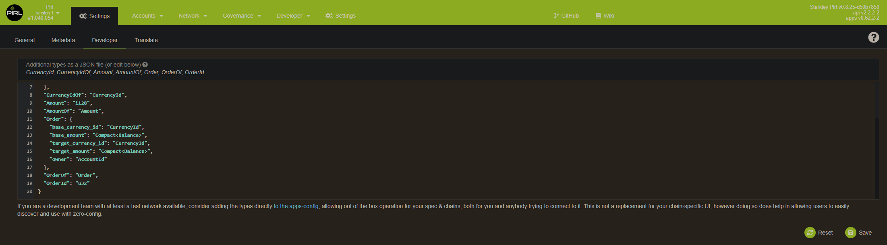

# How to add custom types

To add custom types to explorer, you need to go on settings tab, under developer
or this [link](https://explorer.pirl.network/#/settings/developer)

then add this

```
 {
  "CurrencyId": {
    "_enum": [
      "Native",
      "PIRL"
    ]
  },
  "CurrencyIdOf": "CurrencyId",
  "Amount": "i128",
  "AmountOf": "Amount",
  "Order": {
    "base_currency_id": "CurrencyId",
    "base_amount": "Compact<Balance>",
    "target_currency_id": "CurrencyId",
    "target_amount": "Compact<Balance>",
    "owner": "AccountId"
  },
  "OrderOf": "Order",
  "OrderId": "u32"
} 
```

[](media/customTypes.PNG)

then save

<p align=right> Written by Masterdubs & WeHaveCookie </p>